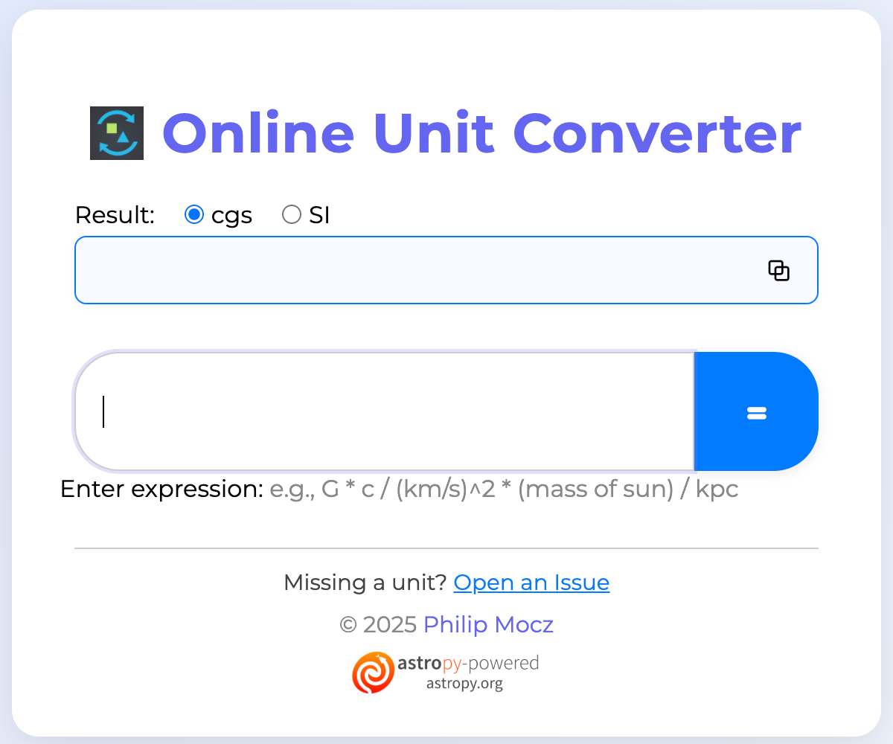

# Online Unit Converter

A Python web application for unit conversion. Users can enter an expression (e.g., `G * c/ (km/s)^2 * (mass of sun) / kpc`) and select the output unit system (e.g., cgs, SI) to get the converted result. Uses the `astropy` library for handling units and `pyodide` for browser-based computation.

Philip Mocz (2025)

## [Try it out!](https://pmocz.github.io/online-unit-converter/)

